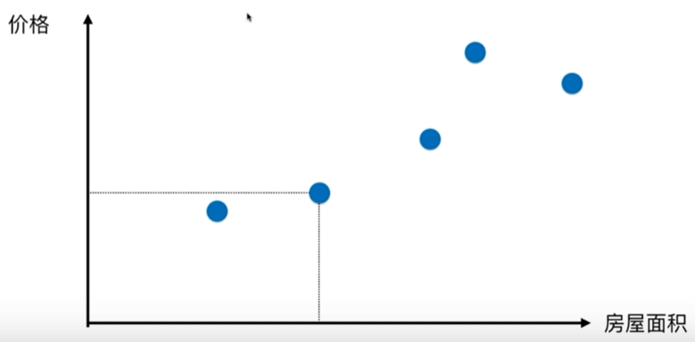
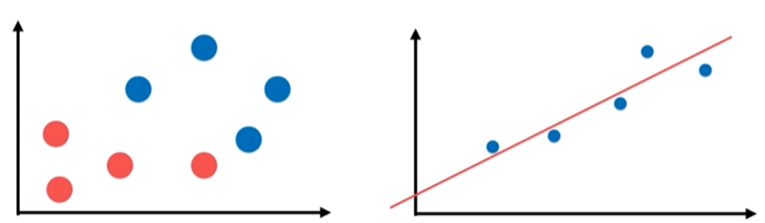
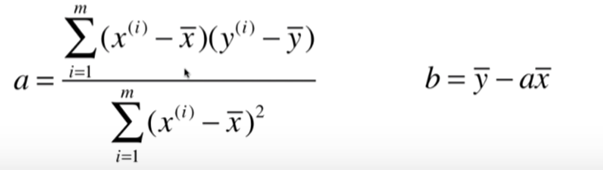

# 线性回归算法

以房产价格预测为例：

线性回归假设房屋面积与价格呈现线性关系。 在假设前提下，线性回归算法的目标是**寻找一条直线，最大程度的“拟合”样本特征和样本输出标记之间的关系。**

对比分类问题的二维平面图：横轴和纵轴都表示样本特征。而样本的输出标记是不同分类所表示的颜色；而回归问题的二维平面图：横轴表示样本特征，而纵轴表示样本输出标记。这是因为回归问题要预测的是一个具体的数值，这个数值在连续的空间里，而不能离散的表示。故需要用到一条数轴的位置。

**只有一个样本特征的回归问题，称为简单线性回归。有多个样本特征的回归问题，称为多元线性回归**

假设我们找到了最佳拟合的直线方程$y=ax+b$，则对每一个样本点$x^{(i)}$，根据我们的直线方程，预测值为$\hat{y}^{(i)}=ax^{(i)}+b$。而真实值为$y^{(i)}$。我们希望真实值$y^{(i)}$和预测值$\hat{y}^{(i)}$之间的差距尽量的小，这样才能说明我们找到了较好的拟合直线方程。

考虑所有的样本$\sum_i (y^{(i)}-\hat{y}^{(i)})^2$，我们的目标就是找到参数$a$和$b$，使$\sum_i (y^{(i)}-ax^{(i)} - b)^2$尽可能的小。

因为$\left| y^{(i)} - \hat{y}^{(i)}\right|$不是处处可导的，不利于后面的最优化求解，故采用$(y^{(i)}-\hat{y}^{(i)})^2$。

上述问题，可以使用最小二乘法进行求解。最小二乘法问题就是最小化误差的平方。求解结果如下：

## 一类机器学习算法的基本思路

通过分析问题，确定问题的损失函数或者效用函数。通过最优化损失函数或者效用函数（目标函数），获得机器学习的最佳模型。

- 损失函数：衡量未拟合的程度
- 效用函数：衡量拟合的程度