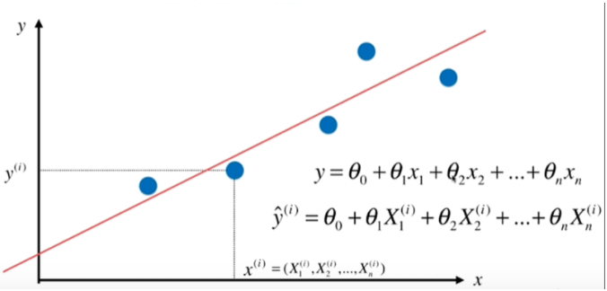
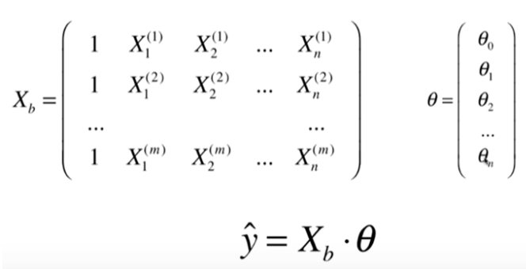

# 多元线性回归

**与简单线性回归的区别是：不再只有一个特征，X表示一个向量。**

多元线性回归的目标是：找到$\theta_0,\theta_1,\theta_2,...,\theta_n$，使得$\sum_{i=1}^m (y^{(i)} - \hat{y}^{(i)})^2$尽可能小。

以向量形式进行表示：
$$
\hat{y}^{(i)} = \theta_0 + \theta_1 X_1^{(i)} + \theta_2 X_2^{(i)} + ... + \theta_n X_n^{(i)}  \\ \theta=(\theta_0, \theta_1,\theta_2,...,\theta_n)^T
$$
添加一个全为1的列向量$X_0^{(i)}=1$，可以使$\theta_0$都添加进矩阵中，方便接下来的运算。
$$
\hat{y}^{(i)} = \theta_0 X_0^{(i)} + \theta_1 X_1^{(i)} + \theta_2 X_2^{(i)} + ... + \theta_n X_n^{(i)} , X_0^{(i)}=1 \\ X^{(i)}=(X^{(i)}_0, X^{(i)}_1,X^{(i)}_2,...,X^{(i)}_n)
$$
故
$$
\hat{y}^{(i)} = X^{(i)} \cdot \theta
$$

于是，目标可以进行形式上的转化：
$$
使\sum_{i=1}^m (y^{(i)} - \hat{y}^{(i)})^2尽可能小 \to 使(y-X_b \cdot \theta)^T(y-X_b \cdot \theta)尽可能小
$$
对上述方程进行利用最小二乘法进行求解，得到
$$
\theta = (X_b^TX_b)^{-1}X_b^Ty
$$
上述解称为正规方程解。

关于正规方程解的问题和优点如下：

1. 问题：时间复杂度高
2. 优点：不需要对数据进行归一化处理。因为参数θ是X的系数，没有量纲的问题。

