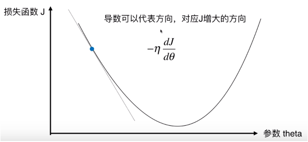
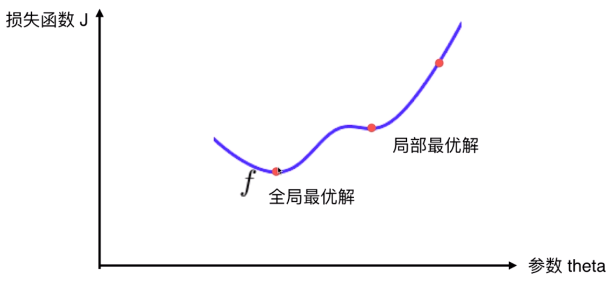

# 梯度下降法

1. 不是一种机器学习算法，而是一种基于搜索的最优化方法。

2. 作用：最小化一个损失函数。如果要最大化一个效用函数的话，使用梯度上升法。

3. 过程：

   

   因为我们需要找的是极小值点，故对导数取负数，即对应$J$减小的方向。

   $\eta$是学习率，是一个超参数，它的取值影响获得最优解的速度，取值不合适的话，甚至得不到最优解。**$\eta$太大，可能导致不收敛，$\eta$太小，减慢收敛速度。**

   **注意：**并不是所有函数都有唯一的极值点。如下图所示：

   

   解决方案如下：

   - 多次运行，随机化初始点。（可见初始点也是一个超参数）